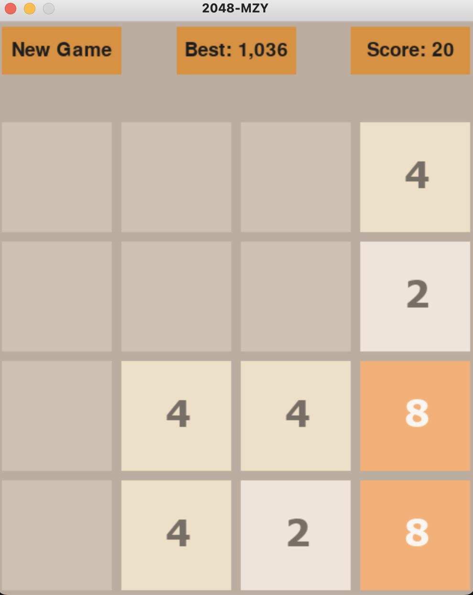

# 2048-MZY
## Introduction
2048 is a single-player sliding tile puzzle video game written by Italian web developer Gabriele Cirulli and published on GitHub.
The objective of the game is to slide numbered tiles on a grid to combine them to create a tile with the number 2048.
## Specifications
I recreated this game with python and pygame for practice purpose. My version is very similar to the original version, except that I didn't implement the animation of sliding and merging tiles.\
Below is a screenshot of the game UI. To play the game, run `main.py`, and then use arrow keys on keyboard to move the tiles. Once the game is over, you'll see a message `YOU WON/LOST` and ask you whether to start a new game or quit (y/q). Besides, remember that you can always restart game by clicking the `New Game` button on top-left of the screen.

